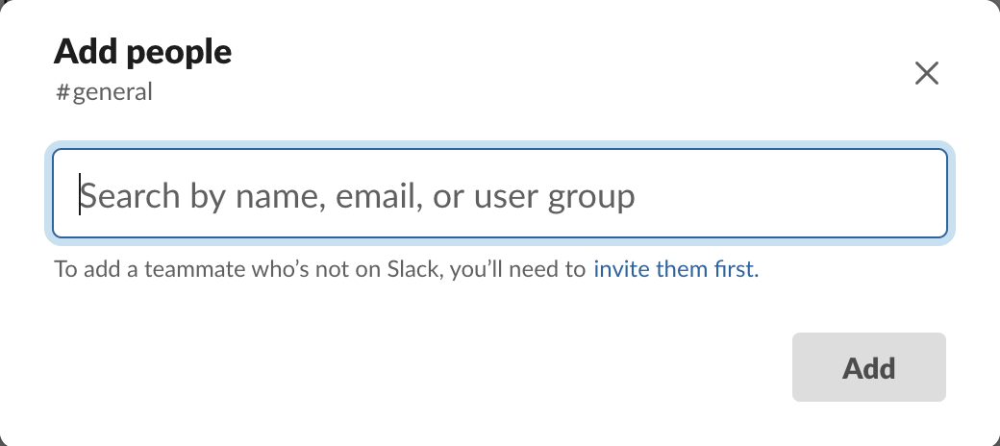

# Slacktivate

 
 
 
 
 

Slacktivate is a Python library and Command-Line Interface
to assist in the provisioning and management of a Slack workspace, using
both the Slack API and the Slack SCIM API:

- Write a YAML specifications to describe your users, channels and groups,
  then have Slacktivate set up your workspace with no manual intervention.
  
- Use the self-documented Slacktivate REPL to immediately do batch operations
  on your Slack workspace and build new powerful macros.

- Robust, Pythonic wrapper to the Slack API and Slack SCIM API clients,
  able to abstract some of the quirks of the API—as well as able to handle
  typical error management (such as rate limiting) transparently.
  
- Find everything you need to be a Slack power user in one place, rather
  than spread to a microcosm of evolving documentations.

## Introduction

Slack is a wonderful platform for chat, with an extensive API that allows for
many powerful integrations. But the Slack client currently (in its most frequently
available interface) does not provide any support for batch operations.

Slacktivate is a powerful tool that allows you to specify the users, group
memberships and channels in a YAML specification file, and to have the tool
automatically synchronize this specification with the Slack workspace.

Below is some context to explain why I created this tool.

### Batch managing users in channels

As an example:
- users [can only be added to a channel one-by-one](https://slack.com/help/articles/201980108-Add-people-to-a-channel),
- users can only be removed from a channel one-by-one,

and when you are managing a Slack workspace with hundreds of users, this can
become a bottleneck of operations very quickly. Slack is actively trying to
address this point, but so far, is not really making a difference---[the
channel manager that was recently introduced](https://slack.com/help/articles/360047512554-Use-channel-management-tools)
still only provides the same modal to add users, and no additional options to remove users.

This problem exists throughout Slack. Beyond the membership of channels, this
issue exists also with the membership of the workspace, of groups, and so on.

Part of the issue is that Slack Enterprise Grid product relies on a
company's existing directory solution to address these needs; but this is
of no use to the many teams that are finding success with a lower tier of
the service. 

### The solution: Automating

<to be written>

## Prerequisites: Having Owner Access and Getting an API Token

In order to use the SCIM API, you need to be an owner of the workspace, and obtain an API token with `admin` scope.

As explained in [the official Slack SCIM API documentation](https://api.slack.com/scim#access), the easiest way to obtain a valid token for the purposes of SCIM provisioning is as follows:
1. As *a Workspace/Organization Owner*, create [a new app for your workspace](https://api.slack.com/apps?new_app=1) (see [here](https://api.slack.com/start/overview#creating) for the documentation).
2. Add the `admin` OAuth scope to [the "User Token Scopes" section](https://api.slack.com/authentication/quickstart#configuring).
3. Install the app to your workspace (see [here](https://api.slack.com/start/overview#installing_distributing) for the documentation).
4. Use the generated token (if you are provided with multiple tokens, use the "OAuth Access Token" not the "Bot User OAuth Access Token").

Note that you can easily *reinstall your app* with different permissions if it turns out you did not select all the necessary permissions.

## License

This project is licensed [under the LGPLv3 license](https://www.gnu.org/licenses/lgpl-3.0.en.html),
with the understanding that importing a Python modular is similar in spirit to dynamically linking
against it.

- You can use the library/CLI `slacktivate` in any project, for any purpose,
  as long as you provide some acknowledgement to this original project for
  use of the library (for open source software, just explicitly including
  `slacktivate` in the dependency such as a `pyproject.toml` or `Pipfile`
  is acknowledgement enough for me!).

- If you make improvements to `slacktivate`, you are required to make those
  changes publicly available.

This license is compatible with the license of all the dependencies as
documented in [this project's own `pyproject.toml`](https://github.com/jlumbroso/slacktivate/blob/master/pyproject.toml#L29-L49).
